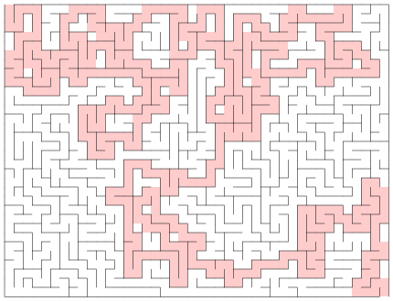

# Maze Generator

This is a simple maze generator written in Rust. It uses the
[recursive backtracker algorithm](https://en.wikipedia.org/wiki/Maze_generation_algorithm#Recursive_backtracker)
to generate mazes.

## Example with solution marked by "x"

```text
┌   ┬---┬---┬---┬---┬---┬---┬---┬---┬---┬---┬---┬---┬---┬---┬---┐
│ x   x   x │                     x   x │     x   x │           │
├---┼---┼   ┼---┼---┼---┼---┼---┼   ┼   ┼---┼   ┼   ┼   ┼   ┼---┤
│       │ x   x   x   x   x   x   x │ x   x │ x │ x │   │       │
├   ┼---┼---┼---┼---┼---┼---┼---┼---┼---┼   ┼   ┼   ┼---┼---┼   ┤
│ x   x   x   x │ x   x │ x   x   x     │ x │ x │ x │ x   x   x │
├   ┼---┼---┼   ┼   ┼   ┼   ┼---┼   ┼---┼   ┼   ┼   ┼   ┼---┼   ┤
│ x │       │ x   x │ x │ x │   │ x │ x   x │ x │ x   x │   │ x │
├   ┼   ┼   ┼---┼---┼   ┼   ┼   ┼   ┼   ┼---┼   ┼---┼---┼   ┼   ┤
│ x │   │           │ x │ x   x │ x   x │ x   x │           │ x │
├   ┼   ┼   ┼---┼---┼   ┼---┼   ┼---┼---┼   ┼---┼   ┼---┼---┼   ┤
│ x │   │           │ x   x   x │     x   x │       │ x   x   x │
├   ┼---┼---┼---┼   ┼---┼---┼---┼   ┼   ┼---┼   ┼---┼   ┼---┼---┤
│ x   x   x   x   x   x │           │ x │   │       │ x   x   x │
├---┼---┼---┼---┼---┼   ┼---┼---┼   ┼   ┼   ┼   ┼   ┼---┼---┼   ┤
│           │ x   x   x │ x   x │   │ x │   │   │           │ x │
├   ┼   ┼---┼   ┼---┼---┼   ┼   ┼---┼   ┼   ┼   ┼---┼   ┼---┼   ┤
│   │         x   x   x   x │ x   x   x │           │         x │
└---┴---┴---┴---┴---┴---┴---┴---┴---┴---┴---┴---┴---┴---┴---┴   ┘
```

## CLI Installation

To install the CLI, first clone this repository:

```bash
git clone git@github.com:wilswer/maze_gen.rs.git
```

and move into the directory `maze_gen.rs` then install the CLI with `cargo`:

```bash
cargo install --path .
```

## CLI Usage

To get a list of all available options, run the CLI with the `--help` flag:

```bash
maze_gen --help
```

To generate a maze, run the CLI with the desired width and height:

```bash
maze_gen -x 20 -y 20
```

To generate a maze with a solution, run the CLI with the `--solution` flag:

```bash
maze_gen -x 20 -y 20 --solution
```

To generate a maze with a solution and save it to a file (do not include extension), run the CLI with the
`--solution` and `--output` flags:

```bash
maze_gen -x 20 -y 20 --solution --output maze
```

This will generate a text file `maze.txt` and an SVG file `maze.svg` in the current directory.

Example SVG output without solution:


Example SVG output with solution marked in red:


